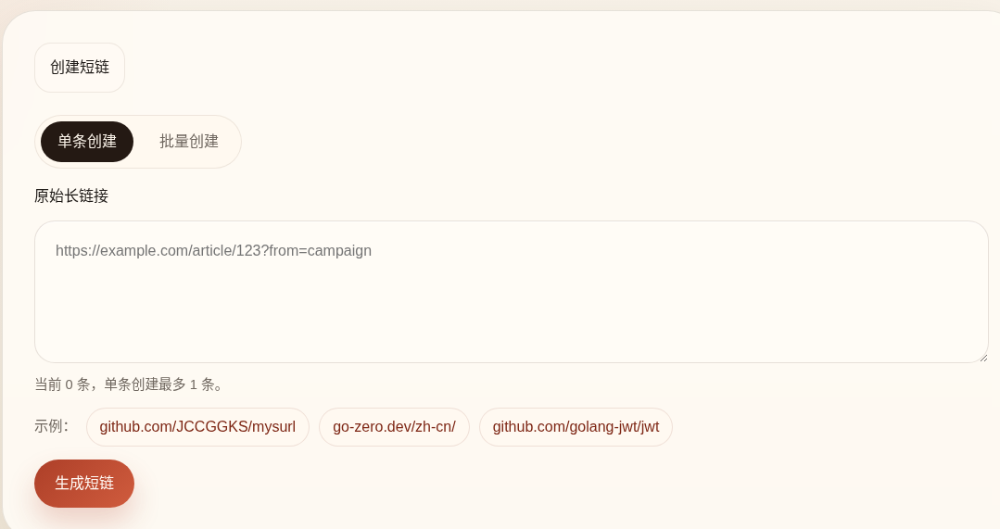
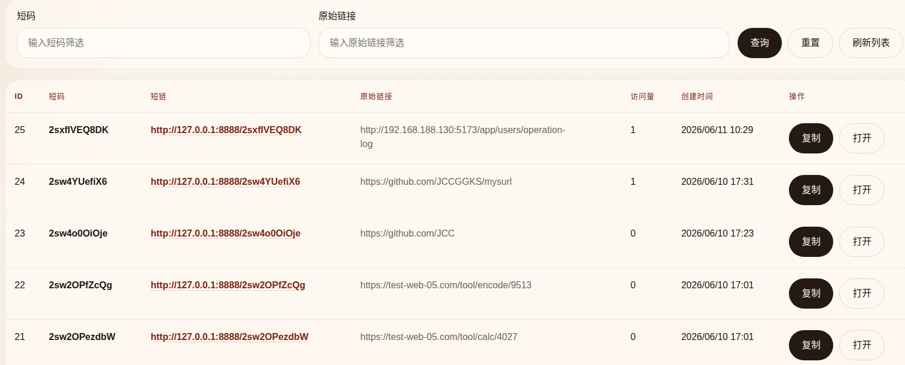
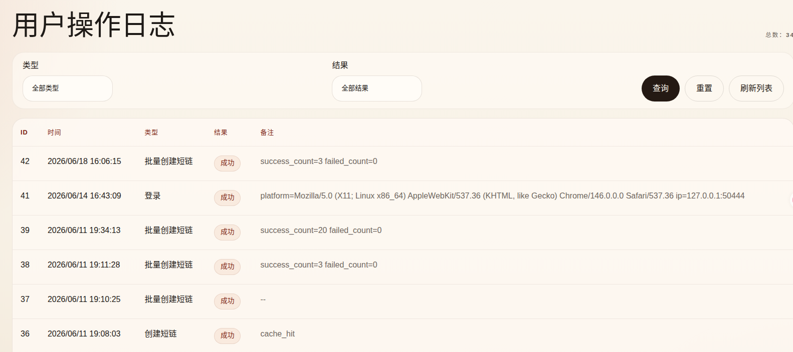
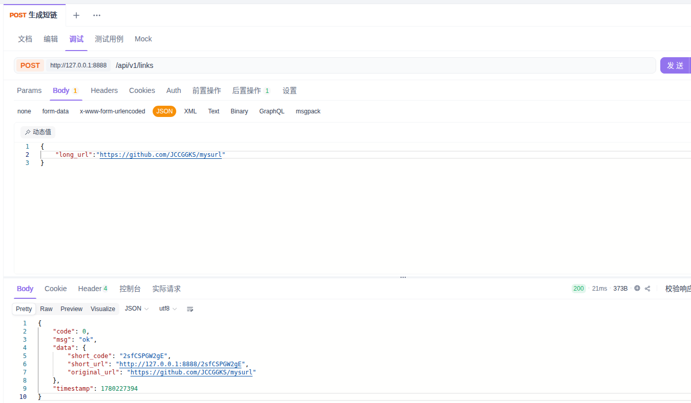

# mysurl1

一个基于 `go-zero` 实现的 Go 短链服务项目。它不只覆盖“长链接转短链接”和“短链接跳转”两条基础链路，也把缓存、Bloom Filter、并发回源控制、访问计数异步回刷，以及 `access token + refresh token` 认证这类后端项目里真正会遇到的问题补齐了。

如果你想找一个适合拆解的中小型 Go Web 项目，这个仓库比较合适。

## 演示图片

### 创建短链



### 短链列表



### 用户操作日志



### 接口调试



## 它解决了什么问题

`mysurl1` 当前主要提供这些能力：

- `POST /api/v1/links`：创建短链
- `POST /api/v1/links/batch`：批量创建短链
- `GET /:code`：302 跳转到原始长链
- `POST /api/v1/auth/register`：注册
- `POST /api/v1/auth/login`：登录
- `POST /api/v1/auth/refresh`：刷新认证
- `POST /api/v1/auth/logout`：登出
- `GET /api/v1/links/mine`：查询当前用户短链列表
- `GET /api/v1/user-operation-logs`：查询用户操作日志

从工程角度，它重点处理了这些问题：

- 相同规范化长链如何复用已有短链
- 短链跳转如何减少数据库压力
- 大量不存在短码如何避免穿透数据库
- 缓存失效时如何避免并发击穿
- 访问次数如何低成本统计
- 用户态接口如何接入双 token 认证

## 核心特性

- 支持三种短码生成策略：
  - `mysql_auto_increment`
  - `redis_incr`
  - `snowflake`
- Redis 精确缓存：
  - `user_id + normalized_url -> short_code`
  - `short_code -> original_url`
- RedisBloom 优化不存在短码的拦截
- `singleflight` 合并缓存失效后的并发回源
- `visit_count` 先走 Redis `INCR` 聚合，再异步回刷 MySQL
- `access token + refresh token` 双 token 认证
- refresh token rotation 与服务端吊销

## 项目结构

- `mysurl1.go`：服务入口
- `etc/mysurl1-api.yaml`：本地配置
- `internal/config`：配置结构体
- `internal/dao`：MySQL / Redis 访问层
- `internal/logic`：业务编排层
- `internal/handler`：HTTP 入口
- `internal/middleware`：认证、操作日志等横切逻辑
- `internal/svc`：依赖注入与服务上下文
- `internal/utils`：通用工具、统一响应、后台 worker
- `internal/template/sqls`：表结构模板
- `internal/template/docs`：PRD 与技术设计文档
- `wrk`：压测脚本与结果记录

这套分层的价值在于职责比较干净：

- `handler` 不处理业务分支
- `logic` 负责流程编排
- `dao` 只处理 MySQL / Redis 细节
- `utils` 放复用能力，而不是业务逻辑

## 架构总览

服务启动入口非常轻，只做配置加载、依赖装配和路由注册：

```go
var c config.Config
conf.MustLoad(*configFile, &c)

server := rest.MustNewServer(c.RestConf)
defer server.Stop()

ctx := svc.NewServiceContext(c)
handler.RegisterHandlers(server, ctx)

server.Start()
```

代码位置：[mysurl1.go](/home/fanqicheng/project/jx/mysurl1/mysurl1.go:1)

依赖统一由 `ServiceContext` 装配：

```go
serviceContext = &ServiceContext{
	Config:      c,
	DB:          newMySQL(c.MySQL),
	Redis:       newRedis(c.Redis),
	FlightGroup: syncx.NewSingleFlight(),
}
serviceContext.ShortLinkCache = dao.NewShortLinkCache(serviceContext.Redis)
serviceContext.ShortLinkDAO = dao.NewShortLinkDAO(serviceContext.DB)
serviceContext.CodeManager = mustNewCodeManager(c.Short, serviceContext.ShortLinkDAO)
utils.StartVisitFlushWorker(serviceContext.DB, serviceContext.ShortLinkCache, c.VisitFlush)
```

代码位置：[internal/svc/servicecontext.go](/home/fanqicheng/project/jx/mysurl1/internal/svc/servicecontext.go:1)

## 创建短链链路

这个项目的创建逻辑不是“直接生成短码然后入库”，而是先复用、再生成：

1. 校验并规范化长链接
2. 先查 Redis 是否已有 `long -> short` 映射
3. 缓存没命中，再查 MySQL
4. 如果已有记录，直接复用
5. 如果没有，再生成短码并入库
6. 回填缓存，并把短码加入 Bloom Filter

核心代码：

```go
shortCode, cacheErr := l.svcCtx.ShortLinkCache.GetLongToShort(l.ctx, userID, normalizedURL)
if cacheErr == nil && shortCode != "" {
	return &createLinkResult{
		ShortCode:   shortCode,
		OriginalURL: normalizedURL,
		Source:      createLinkSourceCacheHit,
	}, nil
}

record, err := l.svcCtx.ShortLinkDAO.FindAvailableByOriginalURL(l.ctx, userID, normalizedURL)
if err == nil && record != nil {
	l.fillCreateCaches(userID, normalizedURL, record.ShortCode)
	return &createLinkResult{
		ShortCode:   record.ShortCode,
		OriginalURL: record.OriginalURL,
		Source:      createLinkSourceDBHit,
	}, nil
}
```

代码位置：[internal/logic/createlinklogic.go](/home/fanqicheng/project/jx/mysurl1/internal/logic/createlinklogic.go:1)

这个实现的重点不在“能创建”，而在于：

- 避免同一用户重复生成相同短链
- 用缓存降低高频重复请求的成本
- 用数据库兜底保证最终一致性

## 短码生成策略

项目把短码生成抽象成了可切换策略：

```go
type Generator interface {
	Provider() string
	NextCode(ctx context.Context) (string, error)
}
```

代码位置：[internal/logic/code_strategy/strategy.go](/home/fanqicheng/project/jx/mysurl1/internal/logic/code_strategy/strategy.go:1)

### 1. MySQL 自增

先插入记录，再把自增主键转成 Base62 短码：

```go
result, err := session.ExecCtx(ctx, insertQuery, userID, normalizedURL, urlHash)
id, err := result.LastInsertId()
shortCode = codestrategy.BuildCodeFromID(uint64(id))
updateQuery := "UPDATE short_links SET short_code = ? WHERE id = ?"
```

代码位置：[internal/dao/shortlinkdao.go](/home/fanqicheng/project/jx/mysurl1/internal/dao/shortlinkdao.go:120)

### 2. Redis 自增

用 Redis 做全局序列号：

```go
sequenceID, err := g.redis.Incr(ctx, redisShortCodeSequenceKey).Uint64()
shortCode := utils.EncodeBase62(sequenceID)
```

代码位置：[internal/logic/code_strategy/redis_incr.go](/home/fanqicheng/project/jx/mysurl1/internal/logic/code_strategy/redis_incr.go:1)

### 3. Snowflake

用雪花算法生成分布式 ID，再转 Base62：

```go
id := g.node.Generate().Int64()
shortCode := utils.EncodeBase62(uint64(id))
```

代码位置：[internal/logic/code_strategy/snowflake.go](/home/fanqicheng/project/jx/mysurl1/internal/logic/code_strategy/snowflake.go:1)

这层抽象的好处很直接：创建链路和发号策略是解耦的，后续要换方案时改动范围很小。

## 短链跳转链路

短链系统真正有意思的部分，是跳转链路的性能设计。

`mysurl1` 的处理顺序是：

1. 先查 Redis 的 `short -> long` 精确缓存
2. 缓存没命中，先用 Bloom Filter 判断是否大概率存在
3. Bloom 判不存在时直接返回 404
4. 可能存在时再查询 MySQL
5. 查询结果回填缓存和 Bloom
6. 使用 `singleflight` 合并同一短码的并发回源
7. 访问量只做 Redis `INCR`，不在请求链路里直接写 MySQL

核心代码：

```go
cacheValue, cacheErr := l.svcCtx.ShortLinkCache.GetShortToLong(l.ctx, code)
if cacheErr == nil && cacheValue != nil {
	return l.returnRedirectTarget(code, cacheValue.ID, cacheValue.OriginalURL, "short->long cache")
}

bloomExists, bloomErr := l.svcCtx.ShortLinkCache.ShortCodeBloomExists(l.ctx, code)
if bloomErr == nil && !bloomExists {
	return "", utils.NotFound("short link not found")
}

result, fresh, err := l.svcCtx.FlightGroup.DoEx(redirectSingleflightKey(code), func() (any, error) {
	record, err := l.svcCtx.ShortLinkDAO.FindAvailableByCode(l.ctx, code)
	...
})
```

代码位置：[internal/logic/redirectlogic.go](/home/fanqicheng/project/jx/mysurl1/internal/logic/redirectlogic.go:1)

这部分把缓存穿透和缓存击穿两个典型问题都覆盖到了。

## Bloom Filter 的降级思路

项目依赖 RedisBloom 做不存在短码的快速拦截，但实现上并没有强绑定模块存在。Redis 未加载 RedisBloom 时，会自动降级到“缓存 + MySQL”路径：

```go
result, err := c.redis.Do(ctx, "BF.EXISTS", bloomShortCodeKey, shortCode).Bool()
if err != nil {
	if c.handleBloomUnavailable(err) {
		return true, nil
	}

	return false, err
}
```

代码位置：[internal/dao/shortlinkcache.go](/home/fanqicheng/project/jx/mysurl1/internal/dao/shortlinkcache.go:1)

这点很实用。很多 demo 会把新组件写成“没装就跑不起来”，这个项目则更偏工程思路。

## 访问统计：异步回刷而不是直写数据库

如果每次跳转都直接更新 MySQL 的 `visit_count`，热点短链会把数据库写压力迅速推高。这里采用的是更稳妥的方案：

- 请求链路里只做 Redis `INCR`
- 后台 worker 定时扫描访问计数键
- 批量事务更新 MySQL
- 刷盘成功后删除 Redis 临时计数

请求链路：

```go
func (c *ShortLinkCache) IncrVisitCount(ctx context.Context, id uint64) error {
	return c.redis.Incr(ctx, visitCountKey(id)).Err()
}
```

后台刷盘：

```go
err = db.TransactCtx(ctx, func(ctx context.Context, session sqlx.Session) error {
	for _, item := range items {
		if _, err := session.ExecCtx(ctx, "UPDATE short_links SET visit_count = visit_count + ? WHERE id = ?", item.delta, item.id); err != nil {
			return err
		}
	}

	return nil
})
```

代码位置：

- [internal/dao/shortlinkcache.go](/home/fanqicheng/project/jx/mysurl1/internal/dao/shortlinkcache.go:1)
- [internal/utils/visit_flush_worker.go](/home/fanqicheng/project/jx/mysurl1/internal/utils/visit_flush_worker.go:1)

这种设计很适合“允许秒级延迟一致”的统计类字段。

## 认证设计：双 token 而不是单 JWT

项目后续版本加入了 `access token + refresh token` 模式：

- `access token`：短期有效，只用于访问业务接口
- `refresh token`：长期有效，只用于刷新和登出
- refresh token 只保存哈希值，支持服务端吊销
- 刷新时采用 rotation，旧 token 立即失效

登录成功后会同时签发双 token，并把 refresh token 哈希写入数据库：

```go
authResp, err := utils.BuildAuthResponse(authConf, utils.AuthClaims{
	UserID:   user.ID,
	Username: user.Username,
})

if err := l.svcCtx.UserRefreshTokenDAO.Insert(
	l.ctx,
	user.ID,
	utils.HashRefreshToken(authResp.RefreshToken),
	time.Unix(authResp.RefreshExpiresAt, 0),
); err != nil {
	return nil, utils.InternalError("save refresh token failed: " + err.Error())
}
```

代码位置：[internal/logic/loginlogic.go](/home/fanqicheng/project/jx/mysurl1/internal/logic/loginlogic.go:1)

TokenPair 的生成逻辑如下：

```go
refreshToken, err := GenerateRefreshToken()
refreshExpiresAt := time.Now().Add(time.Duration(ensureRefreshExpireSeconds(auth)) * time.Second)

return &TokenPair{
	AccessToken:      accessToken,
	AccessExpiresAt:  accessExpiresAt,
	RefreshToken:     refreshToken,
	RefreshTokenHash: HashRefreshToken(refreshToken),
	RefreshExpiresAt: refreshExpiresAt,
}, nil
```

代码位置：[internal/utils/auth.go](/home/fanqicheng/project/jx/mysurl1/internal/utils/auth.go:1)

这比单 JWT 模式更接近真实前后端分离项目的认证做法。

## 依赖与运行环境

- Go `1.24.x`
- MySQL
- Redis

说明：

- `redis_incr` 依赖 Redis 发号
- Bloom 优化依赖 RedisBloom；未安装时会自动降级

## 快速开始

### 1. 初始化表结构

执行这些 SQL 模板：

- [internal/template/sqls/short_links.sql](/home/fanqicheng/project/jx/mysurl1/internal/template/sqls/short_links.sql)
- [internal/template/sqls/users.sql](/home/fanqicheng/project/jx/mysurl1/internal/template/sqls/users.sql)
- [internal/template/sqls/user_refresh_tokens.sql](/home/fanqicheng/project/jx/mysurl1/internal/template/sqls/user_refresh_tokens.sql)
- [internal/template/sqls/user_operation_logs.sql](/home/fanqicheng/project/jx/mysurl1/internal/template/sqls/user_operation_logs.sql)

### 2. 配置服务

默认配置文件是 [etc/mysurl1-api.yaml](/home/fanqicheng/project/jx/mysurl1/etc/mysurl1-api.yaml)：

```yaml
MySQL:
  Host: 127.0.0.1
  Port: 3306
  User: root
  Password: root
  Database: short

Redis:
  Host: 127.0.0.1
  Port: 6379
  Password: ""
  DB: 0

Short:
  BaseURL: http://127.0.0.1:8888
  Provider: snowflake
  Snowflake:
    WorkerID: 1
```

`Short.Provider` 可选值：

- `mysql_auto_increment`
- `redis_incr`
- `snowflake`

### 3. 启动服务

```bash
go run mysurl1.go -f etc/mysurl1-api.yaml
```

## 接口示例

### 注册

```bash
curl -X POST 'http://127.0.0.1:8888/api/v1/auth/register' \
  -H 'Content-Type: application/json' \
  -d '{"username":"demo_user","password":"demo12345"}'
```

### 登录

```bash
curl -X POST 'http://127.0.0.1:8888/api/v1/auth/login' \
  -H 'Content-Type: application/json' \
  -d '{"username":"demo_user","password":"demo12345"}'
```

### 创建短链

```bash
curl -X POST 'http://127.0.0.1:8888/api/v1/links' \
  -H 'Content-Type: application/json' \
  -H 'Authorization: Bearer <access_token>' \
  -d '{"long_url":"https://github.com/JCCGGKS/mysurl"}'
```

返回结构示例：

```json
{
  "code": 0,
  "msg": "ok",
  "data": {
    "short_code": "2sfCSPGW2gE",
    "short_url": "http://127.0.0.1:8888/2sfCSPGW2gE",
    "original_url": "https://github.com/JCCGGKS/mysurl"
  },
  "timestamp": 1748620800
}
```

### 跳转短链

```bash
curl -i 'http://127.0.0.1:8888/2sfCSPGW2gE'
```

成功时返回 `302 Found`，并在 `Location` 响应头中带上目标长链。

## 开发与测试

```bash
go build ./...
go test ./...
go test -cover ./...
gofmt -w .
```

受限环境下可使用：

```bash
GOCACHE=/tmp/gocache go test ./internal/...
```

## 压测与设计文档

压测脚本：

- `wrk/run_create.sh`
- `wrk/run_get.sh`
- `wrk/run_get_noexists_code.sh`

技术文档：

- [internal/template/docs/PRD.md](/home/fanqicheng/project/jx/mysurl1/internal/template/docs/PRD.md)
- [internal/template/docs/TECH_V1.md](/home/fanqicheng/project/jx/mysurl1/internal/template/docs/TECH_V1.md)
- [internal/template/docs/TECH_V2.md](/home/fanqicheng/project/jx/mysurl1/internal/template/docs/TECH_V2.md)
- [internal/template/docs/TECH_V3.md](/home/fanqicheng/project/jx/mysurl1/internal/template/docs/TECH_V3.md)
- [internal/template/docs/TECH_V4.md](/home/fanqicheng/project/jx/mysurl1/internal/template/docs/TECH_V4.md)
- [internal/template/docs/TECH_V5.md](/home/fanqicheng/project/jx/mysurl1/internal/template/docs/TECH_V5.md)
- [internal/template/docs/TECH_V6_AUTH_REFRESH.md](/home/fanqicheng/project/jx/mysurl1/internal/template/docs/TECH_V6_AUTH_REFRESH.md)
- [wrk/wrk1.md](/home/fanqicheng/project/jx/mysurl1/wrk/wrk1.md)
- [wrk/wrk2.md](/home/fanqicheng/project/jx/mysurl1/wrk/wrk2.md)
- [wrk/wrk3.md](/home/fanqicheng/project/jx/mysurl1/wrk/wrk3.md)

## 总结

`mysurl1` 值得看的地方，不是“怎么把 URL 变短”，而是它如何把一个小需求逐步补齐成一套完整的后端链路：

- 有清晰的分层结构
- 有可切换的短码生成策略
- 有缓存、Bloom 和 singleflight 组合优化
- 有异步统计回刷
- 有双 token 认证与刷新机制

如果你正在学习 Go Web、缓存设计或中小型后端项目分层，这个仓库适合拿来做代码走读和二次扩展。
